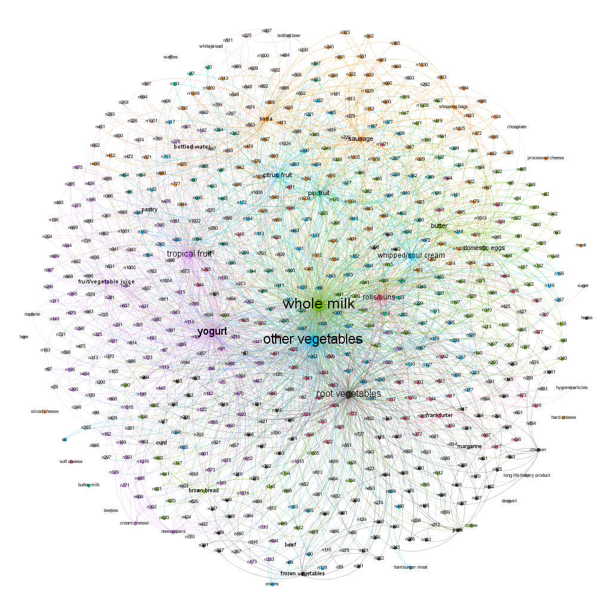

```{r setup, include=FALSE}
knitr::opts_chunk$set(echo = TRUE)
```

# Association Rule Mining

Here we look at a data set containing 9835 different baskets of groceries purchased while shopping to hopefully discover some insightful associations between groceries in these baskets. 

After cleaning the data, we can run it through an apriori algorithm to evaluate association rules between individual grocery items. Apriori returns 1582 total rules.   

```{r, include = FALSE}
library(readr)
library(tidyverse)
library(arules) 
library(arulesViz)

groceries <- read_lines("groceries.txt")

groceries <- strsplit(groceries, split =',')


groceryrules = apriori(groceries,
                     parameter=list(support=.005, confidence=.1, maxlen=20))
```

Now we can look at some of individual the association rules. We are most interested in associations with a relatively high confidence (how often one food item appears in transactions that contain another given item(s)), and high lift (measure of the chances a customer will buy one food item if the customer has already bought another given item(s)). 

A lift greater than 1 implies an increase in purchase probability between two sets of items. The maximum lift of all the rules we've generated is 4.63, with the maximum confidence being .7 so we will want to look at a subset in that upper range. We can look at a subset of rules with confidence greater than .45 and lift greater than 3. 10 rules fall into this subset:   

```{r, echo = FALSE}
## Choose a subset
inspect(subset(groceryrules, subset=lift > 3 & confidence > 0.45))
```

These association rules generally make intuitive sense. Vegetables are associated with purchases of other vegetables, fruit with yogurt, etc. We also notice that some of these categories are quite vague and thus might be more widely associated with many other categories (i.e. "other vegetables").

We can plot the rules together in a Confidence vs. Support as well as a Lift vs. Support plot:  
```{r, echo = FALSE, message = FALSE}
# plot all the rules in (support, confidence) space
# notice that high lift rules tend to have low support
plot(groceryrules, main = 'Confidence vs. Support')

plot(groceryrules, measure = c("support", "lift"), shading = "confidence", main = "Lift vs. Support")

# "two key" plot: coloring is by size (order) of item set
#plot(groceryrules, method='two-key plot')
# can now look at subsets driven by the plot
```

From these plots, we can see a subset of the association rules that have a relatively high support but low lift and confidence. We can look at this subset by limiting our rules to those with a support greater than 0.04. They are shown below: 

```{r, echo = FALSE}
inspect(subset(groceryrules, support > 0.05)[9:14])
```

The rules with high support (fraction of grocery carts that contain both items on the left and on the right) tend to involve items that are extremely popular in general (milk, yogurt, other vegetables). This makes sense as to why they frequently have high support but low lift. 

Finally, we can visualize a network of the association rules generated by the apriori algorithm. From this magnificent plot we can infer that there are a few central items that are closely related to almost everything else in the grocery store including: whole milk, other vegetables, yogurt, and root vegetables. We also see some items of secondary importance such as sausage, whipped cream, and eggs. 

All in all these rules make very much intuitive sense when we consider items that are traditionally popular at grocery stores. 

```{r, include = FALSE}
# ##This chunk simply created the graph to be exported to gephy
# # graph-based visualization
# sub1 = subset(groceryrules, subset=confidence > 0.01 & support > 0.005)
# summary(sub1)
# plot(sub1, method='graph')
# ?plot.rules
# 
# plot(head(sub1, 100, by='lift'), method='graph')
# 
# # export
# saveAsGraph(head(groceryrules, n = 1000, by = "lift"), file = "groceryrules.graphml")
```

