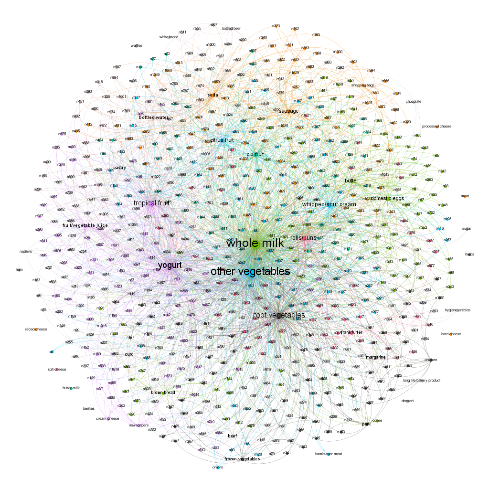

# Question 1 - Green Buildings
```{r setup, include=FALSE}
knitr::opts_chunk$set(echo = TRUE)
```

## 1

From the beginning, I'm suspicious of the excel guru's analysis because first, he cut out buildings that had less than 10% occupancy. This did not take into account the age of the building. If it was developed in the last six months or a year, this less than 10% rule should not be applicable to the building. Yes, there are cases where this less than 10% metric could be a telling factor of the quality of the building or administration, it should not be used as a blanket statement that <=10% occupancy is bad. Secondly, he just took an average of the rent of non-green buildings and green buildings to then forecast premium rent rates of green buildings. He completely disregarded the 21 other variables that could have been used. 

```{r include=FALSE}
library(mosaic)
library(ggplot2)
library(tidyverse)
library(ggplot2)
library(pairwise)
buildings <- read.csv('https://raw.githubusercontent.com/jgscott/STA380/master/data/greenbuildings.csv')
attach(buildings)
buildings$green_rating = as.factor(buildings$green_rating)
```

```{r echo=FALSE}
#Plotting Rent as a function of Size
ggplot(buildings, aes(size, Rent)) +
  geom_point(aes(color = green_rating)) +
  geom_smooth(se = FALSE) +
  labs(x = 'Total Size in Sq. Ft.',
       y = 'Rent per Square Foot, per Year',
       colour = 'Green Rating (0 or 1)') + 
  scale_fill_manual(values = c('navyblue', 'green1')) + 
  ggtitle('Rent as a function of Size', 'Mean size = 234,637.74 sqft.\nGreen Buildings Mean Size = 325,781.32 sqft. \nNon-Green Buildings Mean Size = 225,977.27 sqft.')

mean_size = mean(size)
mean_green = mean(buildings$size[buildings$green_rating == 1])
mean_std = mean(buildings$size[buildings$green_rating == 0])
```
This initial plot shows how Rent changes as the total size of the building increases.While the fitted line is not a good predictor, we can see that the rent price does increase as size of the building increases.

Green buildings have a higher mean building size than standard ones, which can be a reason to believe that green buildings are able to fetch higher rent prices. 


## 2
```{r echo=FALSE}
g = ggplot(buildings, aes(x=Rent))
g + geom_density(aes(fill=factor(green_rating)),alpha = 0.6) + labs(title='Standard vs Green Density') +
  scale_fill_manual(values = c('navyblue', 'green1')) + ggtitle('Standard vs Green Density', "Median Rent = $25.16/sqft./yr. \nGreen Buildings' Median Rent = $27.6/sqft./yr. \nStandard Buildings' Median Rent = $25/sqft./yr.")

median_overall = median(Rent)
median_green = median(buildings$Rent[buildings$green_rating == 1])
median_std = median(buildings$Rent[buildings$green_rating == 0])
```
Here we can see that while green buildings have a slightly higher median compared to standard buildings, they are practically identical. This slightly higher median rent could be attributed to the on average larger building size of the green buildings, but we must look into more variables to get a better idea.

## 3
```{r echo=FALSE}
ggplot(buildings, aes(age, Rent)) +
  geom_point(aes(color = green_rating)) +
  geom_smooth(se = FALSE) +
  labs(x = 'Age (Years)',
       y = 'Rent per Square Foot, per Year',
       colour = 'Green Rating (0 or 1)') +
  scale_fill_manual(values = c('navyblue', 'green1')) + 
  ggtitle("Rent as a function of Age", "Average Age = 47.24 years\n Average Green Age = 23.85 years\n Average Standard Age = 49.47 years")

mean_age = mean(age)
green_age = mean(buildings$age[buildings$green_rating == 1])
standard_age = mean(buildings$age[buildings$green_rating == 0])
```
With age, we can see that there is a gradual decrease in rent as the building ages, but there are many outliers that charge very high rent rates. 

Since there is a negative correlation between age and rent prices, and green buildings have a much lower average age compared to the overall average, we inferred that this can leads to generally higher rent prices for green buildings. 

This factor coupled with their higher than average sizes supports the assumption that buildings with green status can charge a premium in rent.

## 4
```{r echo=FALSE}
temp = buildings$class_a-buildings$class_b
buildings$class[temp == -1] = 'b'
buildings$class[temp == 0] = 'c'
buildings$class[temp == 1] = 'a'

ggplot(data=buildings, aes(x=class, y=Rent)) +
         geom_point(mapping=aes(x=class, y=Rent, colour=green_rating)) +
        geom_boxplot() + 
  labs(x='Class') + 
  scale_fill_manual(values = c('navyblue', 'green1')) + 
  ggtitle('Box plot for each class type', 'Avg. Price Class "A" = $32.32\nAvg. Price Class "B" = $26.39\nAvg. Price Class "C" = $23.94')
        
avg_price_a = mean(buildings$Rent[buildings$class == 'a'])
avg_price_b = mean(buildings$Rent[buildings$class == 'b'])
avg_price_c = mean(buildings$Rent[buildings$class == 'c'])
```
After seeing how Rent changes as a function of numeric variables age and size, we wanted to see how class affects rent. Of course, the highest class building, class A, has the highest median and range, followed by B then C.

## 5
```{r echo=FALSE}
library(ggplot2)
building_a_count = sum(buildings$class =='a')
a_proportion = (building_a_count/nrow(buildings))*100
building_b_count = sum(buildings$class == 'b')
b_proportion = (building_b_count/nrow(buildings))*100
building_c_count = sum(buildings$class == 'c')
c_proportion = (building_c_count/nrow(buildings))*100

green_a_prop = (sum(buildings$class == 'a' & buildings$green_rating == 1)/sum(buildings$green_rating == 1))*100
green_b_prop = (sum(buildings$class == 'b' & buildings$green_rating == 1)/sum(buildings$green_rating == 1))*100
green_c_prop = (sum(buildings$class == 'c' & buildings$green_rating == 1)/sum(buildings$green_rating == 1))*100
green_a = sum(buildings$class == 'a' & buildings$green_rating == 1)
green_c = sum(buildings$class == 'c' & buildings$green_rating == 1)
green_b = sum(buildings$class == 'b' & buildings$green_rating == 1)
ggplot(buildings, aes(x=class, y=..count..)) + 
  geom_bar(aes(fill=green_rating)) +
  scale_fill_manual(values = c('navyblue', 'green1'), name='Standard vs. Green') + 
  labs(x='Class', y='Count') +
  ggtitle('Proportion of Green vs. Standard', 'Proportion of green buildings that are class A = 79.71% (546)\nProportion of green buildings that are class B = 19.27% (132)\nProportion of green buildings that are class C = 1.02% (7)')

```
Here we can see that out of the three classes, green has it's highest number in class A. As we saw above, class A is also the most expensive classification of building. Based on green buildings being nearly 80% class A, one can claim that there is a positive correlation between green status and higher rent prices; if someone were to randomly pick a green building, 4/5 times they would choose a class A, the highest price class.  

```{r echo=FALSE}
ggplot(buildings, aes(x=empl_gr, y=Rent)) + 
  geom_point(size=.5, aes(color=green_rating)) + 
  scale_fill_manual(values = c('navyblue', 'green1'), name='Standard vs. Green') + 
  ggtitle('Rent as a function of YoY Employment Growth Rate by Region') + 
  labs(x='YoY Employment Growth Rate', y='Rent', colour='Green Rating')
```
We were curious on how Rent prices fluctuated, given the year-over-year employment growth rate that each building's region was seeing. While there is a very slight increase in the range of rent prices from the subsets 15% to 60%, we decided that this data is inconclusive. The majority grouping of buildings in the 0-7.5% range has such a wide range of rent prices that it appears that growth rate does not affect rent prices charged. 


## Conclusion
From the three variables tested that provided substantial evidence (Size, Age, and Class), they indirectly showed that people paid a premium for green buildings. While this does support the stats guru's conclusion that the company could price the rent of a green building at a premium, we do not believe that these conclusions provide enough evidence to concretely say that any green building can charge a premium. What we did conclude is that the company should focus more on is the overall size of the building and developing one that would be of class A. 

Size - Since buildings that are larger generally charge higher prices on average, the company should research developing a building larger than average (234,638 sqft.). 
Class - Buildings that are of class A, on average charge the highest rent prices at $32.32/sqft., while class B and class C charge $26.39/sqft.and $23.94/sqft., respectively. 

While we cannot say with certainty that a building that has a received a green rating equates to being able to charge a premium over non-green rated buildings, we do believe that a further in-depth analysis on other variables should be taken generate this answer. 


# Question 2 - ABIA
```{r include =FALSE}
knitr::opts_chunk$set(fig.width=5, fig.height=4) 
library(arules)
library(stats)
library(ggplot2)
library(arulesViz)
library(dichromat)
library(XML)
library(reshape2)
```

# Flights at ABIA
*Visual Story Telling: Create a set of related figures that tell an interesting story about flights into and out of Austin.*

#### Given information about Arrival and Departure Delays, what insights can we gather?
<br>
```{r echo=FALSE}
#read in data file
fly_data = read.csv('https://raw.githubusercontent.com/jgscott/STA380/master/data/ABIA.csv')
attach(fly_data)
#colnames(fly_data)
#dim(fly_data)
```

```{r echo=FALSE, warning=FALSE}
#arrival delay by departure delay
p1 = ggplot(aes(x=DepDelay,y=ArrDelay), data=fly_data)
p1 + geom_point(aes(colour=Distance)) + geom_abline(color='black') + labs(x="Departure Delay (minutes)", y="Arrival Delay (minutes)") + ggtitle("Arrival Delay vs Departure Delay") + theme(plot.title = element_text(hjust = 0.5))
```

First, we plot the relationship between departure and arrival delays. This result shows, not surprisingly, that there is a relationship of approximately y=x. Arrival delays have a tendency to be higher, suggesting in-air delays, such as circling for an available runway on approach. Because arrival delays tend to have a greater influence on flying experience (particularly for connecting flights), we will use arrival delays in our analysis.
<br>
<br>
```{r echo=FALSE, warning = FALSE}
#arrival delay by day of month
p2a = ggplot(aes(x=DayofMonth, y=ArrDelay), data=fly_data)
p2a + geom_point(aes(colour=Distance)) +  stat_summary(fun.y="mean", geom='line', color='black') + labs(x="Day of Month", y="Arrival Delay (mins)") + ggtitle("Delays by Day of the Month") + theme(plot.title = element_text(hjust = 0.5))

#m1 = (aggregate(ArrDelay ~ DayofMonth, fly_data, mean))
#barplot(m1$ArrDelay ~ m1$DayofMonth, xlab='Day of Month', ylab='Average Delay', col='blue4')
```

```{r echo=FALSE, warning = FALSE}
#arrival delay by day of the week
fly_data$DayofWeek[fly_data$DayOfWeek == '1'] = 'Sunday'
fly_data$DayofWeek[fly_data$DayOfWeek == '2'] = 'Monday'
fly_data$DayofWeek[fly_data$DayOfWeek == '3'] = 'Tuesday'
fly_data$DayofWeek[fly_data$DayOfWeek == '4'] = 'Wednesday'
fly_data$DayofWeek[fly_data$DayOfWeek == '5'] = 'Thursday'
fly_data$DayofWeek[fly_data$DayOfWeek == '6'] = 'Friday'
fly_data$DayofWeek[fly_data$DayOfWeek == '7'] = 'Saturday'
fly_data$DayofWeek <- factor(fly_data$DayofWeek,levels = c("Sunday", "Monday", "Tuesday", "Wednesday", "Thursday", "Friday", "Saturday"))

#unique(fly_data$DayofWeek)
#count(fly_data, 'DayofWeek')
fly_d = fly_data[!is.na(fly_data$DayofWeek),]
p2b = ggplot(aes(x=DayofWeek, y=ArrDelay, group = 1), data=fly_d)
p2b + geom_point(aes(colour=Distance)) +  stat_summary(fun.y="mean", geom='line', color='black') + labs(x="Day of Week", y="Arrival Delay (mins)") + ggtitle("Delays by Day of the Week") + theme(plot.title = element_text(hjust = 0.5))

#w1 = (aggregate(ArrDelay ~ DayofWeek, fly_data, mean))
#w2 = qplot(w1$DayOfWeek, w1$ArrDelay, xlab='Day of Week', ylab='Average Delay', col='blue4')
#w2
#barplot(w1$ArrDelay ~ w1$DayofWeek, xlab='Day of Week', ylab='Average Delay', col='blue4')
```

Are there any days you should avoid flying? Arrival delay is plotted against day of the month and day of the week. While there are some slight deviations, the average delay is negligible in either plot (with an overall average of 7.06 mins). Just three days of the month have an average delay over 10 minutes: the 18th, 22nd and 27th. Thursday has the highest average delay at 9.55 minutes.
<br>
<br>
```{r echo=FALSE, warning=FALSE}
#arrival delay by departure time
p3 = ggplot(aes(x=DepTime, y=ArrDelay), data = fly_data)
p3 + geom_point(aes(colour=Distance)) + labs(x="Departure Time (24hr)", y="Arrival Delay (mins)") + ggtitle("Ideal Departure Time") + theme(plot.title = element_text(hjust = 0.5))
```

Next, we look at the best time of day to fly. Intuitively, as the day goes on, delays appear to grow. This follows a common idea that delayed flights in the morning have a domino effect on flights throughout the day. The best time to schedule a flight to avoid a delay is between 5am and 8am.
<br>
<br>
```{r echo = FALSE, warning=FALSE}
fly_dest = fly_data[!(fly_data$Dest == ""),]

#unique(fly_dest$Dest)
#count(fly_dest, 'Dest')

p4 = ggplot(aes(x=Dest, y=ArrDelay), data = fly_dest)
p4 + stat_summary(fun="mean", geom='bar', aes(colour=ArrDelay)) + theme(axis.text.x = element_text(angle = 90, hjust = 1)) + labs(x="Destination", y="Average Arrival Delay (mins)") + ggtitle("Delays by Destination") + theme(legend.position = "none") + theme(plot.title = element_text(hjust = 0.5))

#DSM bad
#FLL, IND, PHL, SLC, TUL good
#library(plyr)

#dests = ggplot(aes(x=Dest), data = fly_data) +
  #geom_bar(fill='blue4', position='dodge') +
  #ggtitle('Number of Flights by Destination') + 
  #theme(axis.text.x = element_text(angle = 90, hjust = 1)) +
  #labs(x="Destination", y="Number of Flights")
#print(dests)
```

Are there any airports to avoid? Based on average arrival delay, it seems that we should never fly to Des Moines (DSM) as it has the highest average delay by a wide margin. However, upon further inspection, there is only data from a single flight from DSM in the set. 
<br>
<br>
```{r echo = FALSE, warning=FALSE, out.width = "100%"}
df2=fly_dest[!(fly_dest$Dest=="DSM" | fly_dest$Dest=="DTW" | fly_dest$Dest == "ORF"),]

p4b = ggplot(aes(x=Dest, y=ArrDelay), data = df2)
p4b + stat_summary(fun='mean', geom='bar',aes(colour=ArrDelay)) + theme(axis.text.x = element_text(angle = 90, hjust = 1)) + labs(x="Destination", y="Average Arrival Delay (mins)") + ggtitle("Delays by Destination (Sample > 1)") + theme(plot.title = element_text(hjust = 0.5))
```

Excluding destinations with one flight (DSM, DTW and ORF), New Orleans (MSP) is now the airport with the longest average delay of over 15 minutes. In contrast, flights going into Baltimore (BWI), Fort Lauderdale (FLL), Indianapolis (IND), Philadelphia (PHL), Salt Lake City (SLC), Tulsa (TUL), and Tucson (TUS) all actually arrive ahead of schedule, on average. These are the best airports to fly into if leaving Austin and looking to avoid a delay. 
<br>
<br>
```{r echo = FALSE, warning=FALSE}
fly_data$UniqueCarrier[fly_data$UniqueCarrier == '9E'] = 'Endeavor'
fly_data$UniqueCarrier[fly_data$UniqueCarrier == 'AA'] = 'American'
fly_data$UniqueCarrier[fly_data$UniqueCarrier == 'YV'] = 'Mesa'
fly_data$UniqueCarrier[fly_data$UniqueCarrier == 'NW'] = 'Northwest'
fly_data$UniqueCarrier[fly_data$UniqueCarrier == 'CO'] = 'Continental'
fly_data$UniqueCarrier[fly_data$UniqueCarrier == 'XE'] = 'JetSuite'
fly_data$UniqueCarrier[fly_data$UniqueCarrier == 'B6'] = 'Air Bangladesh'
fly_data$UniqueCarrier[fly_data$UniqueCarrier == 'WN'] = 'Southwest'
fly_data$UniqueCarrier[fly_data$UniqueCarrier == 'UA'] = 'United'
fly_data$UniqueCarrier[fly_data$UniqueCarrier == 'OO'] = 'Skywest'
fly_data$UniqueCarrier[fly_data$UniqueCarrier == 'OH'] = 'PSA'
fly_data$UniqueCarrier[fly_data$UniqueCarrier == 'EV'] = 'ExpressJet'
fly_data$UniqueCarrier[fly_data$UniqueCarrier == 'US'] = 'US Airways'
fly_data$UniqueCarrier[fly_data$UniqueCarrier == 'MQ'] = 'Envoy Air'
fly_data$UniqueCarrier[fly_data$UniqueCarrier == 'F9'] = 'Frontier'
fly_data$UniqueCarrier[fly_data$UniqueCarrier == 'DL'] = 'Delta'

#count(fly_data, 'UniqueCarrier')
#unique(fly_data$UniqueCarrier)

#p5 = ggplot(aes(x=UniqueCarrier), data = fly_data) +
  #geom_bar(fill='blue4', position='dodge') +
  #ggtitle('Number of Flights by Carrier') + 
  #labs(x="Carrier Name", y="Number of Flights") + theme(axis.text.x = element_text(angle = 90)) + theme(plot.title = element_text(hjust = 0.5))
#print(p5)

fly_carr = fly_data[!(fly_data$UniqueCarrier == ""),]

#unique(fly_carr$UniqueCarrier)
#count(fly_carr, 'UniqueCarrier')

p8 = ggplot(aes(x=UniqueCarrier, y=ArrDelay), data = fly_carr)
p8 + stat_summary(fun="mean", geom='bar', color='blue4') + theme(axis.text.x = element_text(angle = 45, hjust = 1)) + labs(x="Airline", y="Average Arrival Delay (mins)") + ggtitle("Delays by Carrier") + theme(legend.position = "none") + theme(plot.title = element_text(hjust = 0.5))
```

Which carriers are most likely to be delayed? Based on average arrival delay, PSA Airlines is the most likely to be responsible for your missed connection, followed by Delta. On the other end of the spectrum, US Airways is the only carrier that will, on average, get you there ahead of schedule. 
<br>
<br>
```{r echo = FALSE, warning=FALSE}
CarrierDelay <- as.integer(CarrierDelay)
WeatherDelay <- as.integer(WeatherDelay)
NASDelay <- as.integer(NASDelay)
SecurityDelay <- as.integer(SecurityDelay)
LateAircraftDelay <- as.integer(LateAircraftDelay)
CarrierDelay[is.na(CarrierDelay)] = 0
WeatherDelay[is.na(WeatherDelay)] = 0
NASDelay[is.na(NASDelay)] = 0
SecurityDelay[is.na(SecurityDelay)] = 0
LateAircraftDelay[is.na(LateAircraftDelay)] = 0
delays = data.frame(row.names = c('CarrierDelay', 'WeatherDelay', 'NASDelay', 'SecurityDelay', 'LateAircraftDelay'), 'Total'=c(sum(CarrierDelay), sum(WeatherDelay), sum(NASDelay), sum(SecurityDelay), sum(LateAircraftDelay)))
delay_count = c(sum(CarrierDelay>0), sum(WeatherDelay>0), sum(NASDelay>0), sum(SecurityDelay>0), sum(LateAircraftDelay>0))
delays$delay_count = delay_count
ggplot(delays, aes(x=rownames(delays), y=delay_count)) +
  geom_bar(stat = 'identity', fill='deepskyblue4', colour = 'blue4') +
  ggtitle('Number of Delays Recorded by Type') +
  xlab('Type of Delay') +
  ylab('Number of Delays') + theme(plot.title = element_text(hjust = 0.5))
```

Finally, what's causing all these delays anyway? Clearly, Carrier Delays, Late Aircraft, and NAS (National Aviation System) Delays are the most significant culprits, with Security and Weather Delays relatively infrequent. This can be misleading, however, as NAS delays include all *non-extreme* weather issues, which can be reduced with corrective action by airports or the FAA, among other factors like heavy air traffic and airport operations issues. Weather Delays only refer to rare extreme weather events that cannot be mitigated.
<br>
<br>

# Question 3 - Portfolio Modeling
```{r, echo=FALSE, warning=FALSE, results='hide', message=FALSE}
library(mosaic)
library(quantmod)
library(foreach)

mystocks = c('EMB','IEF','DVY','VIXY','XLF','XLV','VGK','XLP','QLD','IWN')
getSymbols(mystocks, from='2015-08-10')

#Adjusting for splits
for(ticker in mystocks) {
  expr = paste0(ticker, "a = adjustOHLC(", ticker, ")")
  eval(parse(text=expr))
}

```
## Selecting the ETFS:
### In constructing our portfolio of ETF's we wanted to select a subgroup that could itself be arranged into separate portfolios of differing characteristics, but still be sufficiently diversified. Our first selection was EMB, J.P. Morgan's emerging markets bond ETF, chosen due to recent data showing emerging market bond's outperforming US and European bond ETFs. We then chose IEF, an ETF tracking 7-10 year treasury bonds, generally seen as a relatively safe, albeit underperforming, fixed income group. DVY, the iShares Select Dividend ETF, was chosen to provide our portfolio some consistent income. VIXY, a short-term volatility index, was chosen to take advantage of the current levels of volatility. XLF, the Financial Sector Select SPDR fund, was chosen to take advantage of the returns that financial services tend to provide, but have provided in a surprising way during the COVID recession. XLV is a Health Care index and was chosen as somewhat of a bet that health care related firms would be receiving some level of stimulus and a lot of attention, both from customers and investors, as treatments for COVID and distribution of PPE is widely sought after. Chosing VGK, the Vanguard FTSE Europe ETF, was due in large part to the recent stimulus package approved by EU nations that should bolster the gradual reopening we are seeing in Europe that should lead to some positive returns over the coming quarters for EU based firms. Furthermore, gaining exposure to Europe, the only major market so far neglected in the portfolio provides some naive diversification at the very least. XLP is a consumer staples ETF that should see some positive returns, and has had some very positive returns over the last 6 months, as customers are rushing to stock up on staple goods. QLD is a leveraged equity ETF that tracks the Nasdaq-100 index and seeks to return 2x the returns of the its underlying index. Given the recent returns of tech companies, which make up a considerable portion of the Nasdaq, which should continue as the US remains relatively locked down, this seemed like a very safe investment. Finally, the IWN, which tracks the Russell 2000, was chosen as a means of gaining exposure to small-cap value stocks, securities that have seen generally positive returns over growth stocks, and idea that serves as the basis for the Fama-French valuation model.


## Selecting the First Portfolio
### While a three security portfolio is generally never a great idea, due to lack of diversification, we decided to construct one anyways to at least prove in subsequent iterations why more securities in a portfolio will generally provide better, or less volatile, returns. 

### The portfolio selected included our IEF, DVY, and VGK ETFs, which represent our safest selections. Fixed income and dividends, mixed with a European equity ETF, should provide relatively stable returns without introducing much risk. The first step was binding the returns, setting equal weights, then running the bootstrap to simulate returns over a 4 week period.

```{r cars}
#Bind first row into return matrix
small_returns = cbind(ClCl(IEFa), ClCl(DVYa), ClCl(VGKa))

small_returns = as.matrix(na.omit(small_returns))
N = nrow(small_returns)

initial_wealth = 100000
my_weights1 = c(1/3,1/3,1/3)

set.seed(1234)

small_sim = foreach(i=1:5000, .combine='rbind') %do% {
  total_wealth = initial_wealth
  weights = my_weights1
  holdings = weights*total_wealth
  n_days = 20
  wealthtracker = rep(0,n_days)
  for(today in 1:n_days) {
    return.today = resample(small_returns,1,orig.ids=FALSE)
    holdings = weights*total_wealth
    holdings = holdings*(1+return.today)
    total_wealth = sum(holdings)
    holdings = weights*total_wealth
    wealthtracker[today] = total_wealth
  }
  wealthtracker
}

head(small_sim)
hist(small_sim[,n_days], 25)

mean(small_sim[,n_days])
mean(small_sim[,n_days] - initial_wealth)
hist(small_sim[,n_days]- initial_wealth, breaks=30)

# 5% value at risk:
quantile(small_sim[,n_days]- initial_wealth, prob=0.05)
```
### Despite our best efforts to reduce volatility, it is clear in our results that we were not successful. Our mean return over the 20 day period was $422.21. Not surprising given the fact that investments in fixed income and dividend stocks are generally not made for huge returns on equity, but rather for the provision of income and their relative safety in times of uncertainty. 

### It should be noted, however, that we are in a period of unprecedented uncertainty and a time in which treasury securities' returns are historically low. Given these two facts, it is equally unsurprising that our VaR, or Value at Risk, a measure that estimates how much a set of investments might lose at the 5% confidence interval, is -$5,277.57. That is considerably more than our mean returns which shows that this is likely not a great portfolio to invest in at this time. Even though this is the least likely scenario, it is a measure that some investors put a lot of weight in given the relative increase in "black swan" events.

### It should be noted of course that our distribution is centered around slightly positive returns, which means on average an investor can expect positive returns from this portfolio.

## Choosing the Second Portfolio

### In choosing the second portfolio, we sought to build on the first rather than select a whole new subset of securities. We did this to stay consistent with our effort to show the effect of diversification in a portfolio. For this portfolio, we added three more securities, EMB, XLF, and QLD. We saw these additions as relatively aggressive additions because of the outsized returns that we expect these securities to provide in the current market conditions.

```{r pressure}

medium_returns = cbind(ClCl(IEFa), ClCl(DVYa), ClCl(VGKa), ClCl(EMBa),
                      ClCl(XLFa), ClCl(QLDa))

medium_returns = as.matrix(na.omit(medium_returns))
N = nrow(medium_returns)

initial_wealth = 100000
my_weights2 = c(1/6,1/6,1/6)

set.seed(1234)

medium_sim = foreach(i=1:5000, .combine='rbind') %do% {
  total_wealth = initial_wealth
  weights = my_weights2
  holdings = weights*total_wealth
  n_days = 20
  wealthtracker = rep(0,n_days)
  for(today in 1:n_days) {
    return.today = resample(medium_returns,1,orig.ids=FALSE)
    holdings = weights*total_wealth
    holdings = holdings*(1+return.today)
    total_wealth = sum(holdings)
    holdings = weights*total_wealth
    wealthtracker[today] = total_wealth
  }
  wealthtracker
}

head(medium_sim)
hist(medium_sim[,n_days], 25)

mean(medium_sim[,n_days])
mean(medium_sim[,n_days] - initial_wealth)
hist(medium_sim[,n_days]- initial_wealth, breaks=30)

# 5% value at risk:
quantile(medium_sim[,n_days]- initial_wealth, prob=0.05)

```

### As we suspected, the returns did exceed the safe portfolio created in the first iteration. In fact, the mean returns, $1318.80 far exceeded the returns of the initial portfolio.

### However, the VaR of this portfolio, -$7398.02 also exceeds the first portfolio. Considering the aggressive additions for this portfolio, that is not completely surprising, but it doesn't back up our hypothesis that additional securities, even aggressive securities, would reduce the overall risk of the portfolio. It should be noted of course that our distribution is centered around slightly positive returns, which means on average an investor can expect positive returns from this portfolio.

##Selecting the Final Portfolio

### For the final portfolio, we added all of the rest of our securities. 

```{r}

#Bind first row into return matrix
all_returns = cbind(ClCl(EMBa), ClCl(IEFa), ClCl(DVYa), ClCl(VIXYa), ClCl(XLFa),
                    ClCl(XLVa), ClCl(VGKa), ClCl(XLPa), ClCl(QLDa),  ClCl(IWNa))

#Get rid of NA first row
all_returns = as.matrix(na.omit(all_returns))
N = nrow(all_returns)

#plots pairs and historical returns
pairs(all_returns)
plot(all_returns[,1],type='l')


initial_wealth = 100000
my_weights3 = c(.1,.1,.1,.1,.1,.1,.1,.1,.1,.1)

set.seed(1234)

big_sim = foreach(i=1:5000, .combine='rbind') %do% {
  total_wealth = initial_wealth
  weights = my_weights3
  holdings = my_weights3*total_wealth
  n_days = 20
  wealthtracker = rep(0,n_days)
  for(today in 1:n_days) {
    return.today = resample(all_returns,1,orig.ids=FALSE)
    holdings = weights*total_wealth
    holdings = holdings*(1+return.today)
    total_wealth = sum(holdings)
    holdings = weights*total_wealth
    wealthtracker[today] = total_wealth
  }
  wealthtracker
}

head(big_sim)
hist(big_sim[,n_days], 25)

mean(big_sim[,n_days])
mean(big_sim[,n_days] - initial_wealth)
hist(big_sim[,n_days]- initial_wealth, breaks=30)

# 5% value at risk:
quantile(big_sim[,n_days]- initial_wealth, prob=0.05)

```

### The results of our final portfolio provide the most interesting information. One, or several, of the securities added to our six security portfolio essentially erased some of the returns from our six security portfolio. On the other hand, our VaR was also reduced significantly. It should be noted of course that our distribution is centered around slightly positive returns, which means on average an investor can expect positive returns from this portfolio.

### In fact, this portfolio created returns above the initial 3 stock portfolio, with risk less than the 6 stock portfolio. This generally follows the theory that higher returns result in higher risk. However, the higher risk associated with adding 7 additional securities to the intial portfolio is not significantly higher, which may show that we successfully diversified while increasing returns. This is certainly not conclusive, but a strong step towards creating an effective portfolio of ETFs.


# Question 4 - Market Segmentation

```{r include=FALSE}
knitr::opts_chunk$set(echo = TRUE)
knitr::opts_chunk$set(fig.width=5, fig.height=4) 
```

  NutrientH20 has requested a market segment analysis on their social media audience. We are given 7,882 twitter followers along with the frequency with which they've tweeted about 36 different topics. 
  
  From a basic sweep over the various topics, one might assume that some are more correlated than others. For instance, those tweeting about Health and Nutrition are likely to be the same people tweeting about personal fitness. However, given the multitude of possible groupings of these topics, we will want to automate the process. For that, we conduct a k-means clustering analysis. While most of the topics are relevant, we have removed the "chatter" and "uncategorized" topics from our topic list as they appear to have been used by annotators to classify tweets that didn't fit into other categories. They likely represent a multitude of topics so we omit them to avoid the k-means model assuming that they represent one topic.  
  
  To choose the optimal number of clusters, we first look at the Gap Statistic for various values of k.  
  
```{r, include= FALSE}
#### Import Data
library(readr)
SM <- read_csv("https://raw.githubusercontent.com/jgscott/STA380/master/data/social_marketing.csv")
SM$chatter <- NULL
SM$unknown <- NULL
rownames(SM) <- SM$X1
SM$X1 <- NULL
summary(SM)

# Center and scale the data
X = SM[,(1:34)]
X = scale(X, center=TRUE, scale=TRUE)
X = na.omit(X)

# Extract the centers and scales from the rescaled data 
mu = attr(X,"scaled:center")
sigma = attr(X,"scaled:scale")
```

```{r , echo=FALSE, message = FALSE}
#Choose value of k
#WARNING: This takes a while
library(cluster)
#SM_gap = clusGap(X, FUN = kmeans, nstart = 50, K.max = 10, B = 5)
#plot(SM_gap, main = 'Gap Statistic vs. Number of Clusters')
```
  


With no clearn kinks in this gap statistic plot, we are not getting a clear definition of what number of clusters to choose, and the data is not converging cleanly before k =10. However, we decide to choose 5 clusters to hopefully identify easily interpretable market segments within the NutrientH20 social media following.  

Now we can construct our k-means clustering with k=5 and 25 initial configurations. The k-means algorithm clusters by the following percentages (we will look at the characteristics of these clusters shortly):  


```{r , include = FALSE}
# Run k-means with 5 clusters and 25 starts
set.seed(23)
clust1 = kmeans(X, 5, nstart=25)

# What are the clusters?
clust1$center  # not super helpful
clust1$center[1,]*sigma + mu
clust1$center[2,]*sigma + mu
clust1$center[3,]*sigma + mu
clust1$center[4,]*sigma + mu
clust1$center[5,]*sigma + mu

# Which cars are in which clusters?
which(clust1$cluster == 1)
which(clust1$cluster == 2)
which(clust1$cluster == 3)
which(clust1$cluster == 4)
which(clust1$cluster == 5)

a = length(which(clust1$cluster ==1))/length(clust1$cluster)

b = length(which(clust1$cluster ==2))/length(clust1$cluster)

c = length(which(clust1$cluster ==3))/length(clust1$cluster)
d = length(which(clust1$cluster ==4))/length(clust1$cluster)

e = length(which(clust1$cluster ==5))/length(clust1$cluster)
```

Group 1 - 61.38% of twitter following  

Group 2 - 9.99% of twitter following  

Group 3 - 9.07% of twitter following  

Group 4 - 7.66% of twitter following  

Group 5 - 11.89% of twitter following  


After automating the market segment split via kmeans, we confirm our cluster choices by conducting a k-means++ initialization and comparing the centroids of our clusters from each initialization method.    

```{r, include = FALSE}
library(LICORS)
# Using kmeans++ initialization
clust2 = LICORS::kmeanspp(X, k=5, nstart=25)

clust2$center[1,]*sigma + mu
clust2$center[2,]*sigma + mu
clust2$center[4,]*sigma + mu

# Which cars are in which clusters?
which(clust2$cluster == 1)
which(clust2$cluster == 2)
which(clust2$cluster == 3)
```


```{r, include= FALSE}
# Compare versus within-cluster average distances from the first run
kmeans = clust1$withinss
kmeanspp = clust2$withinss
sum(clust1$withinss)
sum(clust2$withinss)
clust1$tot.withinss
clust2$tot.withinss
clust1$betweenss
clust2$betweenss
```

Within-cluster average distances for the first run are identical for k-means and k-means++ after 25 iterations.

Kmeans average distances:  
```{r, echo= FALSE}
sort(kmeans)
```
K-means++ average distances:  

```{r, echo= FALSE}
sort(kmeanspp)
```

We can see that from both k-means and k-means++ initialization, we receive identical groups for our 5 clusters. 

Having established five different market segments, we can explore the characteristics of each segment visually through a few topic comparison plots.   

```{r , echo=FALSE}
library(ggplot2)
# A few plots with cluster membership shown
# qplot is in the ggplot2 library
```


```{r , echo=FALSE}
qplot(health_nutrition, cooking, data=SM, color=factor(clust1$cluster), main = 'Interest in Health vs. Cooking for Different Market Segments')
```

Here we see an interesting split between clusters - although group 5 seems to care greatly about health and nutrition, they care less about cooking than does group 4. This gives us the inkling that group 5 might be our "fit" group.   

```{r , echo=FALSE}
qplot(health_nutrition, politics, data=SM, color=factor(clust1$cluster),main = 'Interest in Health vs. Politics for Different Market Segments')
```

Here we can see that group 3 concerns themselves with politics far more often than do the other twitter followers.   

```{r , echo=FALSE}
qplot(politics, parenting, data=SM, color=factor(clust1$cluster),main = 'Interest in Politics vs. Parenting for Different Market Segments')
```

Here we can see that group 2 is more concerned with parenting than any other group. This might be a more family-oriented audience.   

```{r , echo=FALSE}
qplot(online_gaming, outdoors, data=SM, color=factor(clust1$cluster),main = 'Interest in Online Gaming vs. The Outdoors for Different Market Segments')
```

Finally, here we again see that our "fit" group - group 5-  is the most interested in the outdoors, while group 1 stands out as having interests in online gaming.   

Thus, we can see some distinct characteristics about each cluster of NutrientH20 twitter followers. We can look at the top 5 defining topics for the centroids of each cluster to start to develop a better idea of who falls into each group. 

## "The General Public"

```{r,echo = FALSE}
listed = clust1$center[1,]*sigma + mu
head(sort(listed, decreasing = TRUE), n = 5)
```

Group 1 tends to share photos and post about online gaming, college, and shopping at higher rates than other groups. However, none of the topics stand out with a particularly high importance. It appears k-means has defined this cluster as a "catch-all" for individuals who don't fit the four molds described below. 

## "Family-Oriented

```{r,echo = FALSE}
listed = clust1$center[2,]*sigma + mu
head(sort(listed, decreasing = TRUE), n = 5)
```

Group 2 concerns themselves with sports fandom, religion, food and family topics. We might assume this to be middle-aged parents and a generally more family-oriented audience.   


## "Internationally Aware"
```{r,echo = FALSE}
listed = clust1$center[3,]*sigma + mu
head(sort(listed, decreasing = TRUE), n = 5)
```
Group 3 posts frequently about politics, news, and travel. These might be internationally inclined, exploratory individuals.


## "The Insta Girls"
```{r,echo = FALSE}
listed = clust1$center[4,]*sigma + mu
head(sort(listed, decreasing = TRUE), n = 5)
```

Group 4 tends to frequently share photos and concern themselves with cooking, fashion, and beauty.  


## "The Fit-Focused"
```{r,echo = FALSE}
listed = clust1$center[5,]*sigma + mu
head(sort(listed, decreasing = TRUE), n = 5)
```
Group 5 posts are very much focused on health, nutrition, fitness, and to a lesser extent the outdoors. This may very well be NutrientH20's target market.   
  

  
Given NutrientH20's branding, we might assume some interest in the seemingly health and fitness-focused market segment that is group 5. Below we have compiled the 937 "group 3" members that tend to be health, nutrition, and fitness inclined. We display the first five user codes as an example.

```{r, include = FALSE}
SM <- read_csv("https://raw.githubusercontent.com/jgscott/STA380/master/data/social_marketing.csv")
indices = which(clust1$cluster == 5) 
FitFollowers <- SM[c(indices),]$X1
```


```{r, echo = FALSE}
head(FitFollowers)
# 870 fitness-interested followers
```
Without full information on its marketing strategy, we cannot be certain as to which consumers NutrientH20 wishes to target. However, we suspect that the "Fit-Focused" group, as characterized above by interests in health and personal fitness, might be the most receptive of Nutrient H20's marketing material. We should note that this demographic only makes up 12% of NutrientH20's Twitter following, and still might find value in marketing to "The General Public" (61% of following) or "The Insta Girls" (8% of following). 

We hope this has helped NutrientH20 identify its target market among its twitter followers and be able to target advertising to this group of customers more effectively. 


# Question 5 - Author Attribution


# Question 6 - Association Rule Mining


```{r include=FALSE}
knitr::opts_chunk$set(echo = TRUE)
```

Here we look at a data set containing 9835 different baskets of groceries purchased while shopping to hopefully discover some insightful associations between groceries in these baskets. 

After cleaning the data, we can run it through an apriori algorithm to evaluate association rules between individual grocery items. Apriori returns 1582 total rules.   

```{r, include = FALSE}
library(readr)
library(tidyverse)
library(arules) 
library(arulesViz)

groceries <- read_lines("https://raw.githubusercontent.com/jgscott/STA380/master/data/groceries.txt")

groceries <- strsplit(groceries, split =',')


groceryrules = apriori(groceries,
                     parameter=list(support=.005, confidence=.1, maxlen=20))
```

Now we can look at some of individual the association rules. We are most interested in associations with a relatively high confidence (how often one food item appears in transactions that contain another given item(s)), and high lift (measure of the chances a customer will buy one food item if the customer has already bought another given item(s)). 

A lift greater than 1 implies an increase in purchase probability between two sets of items. The maximum lift of all the rules we've generated is 4.63, with the maximum confidence being .7 so we will want to look at a subset in that upper range. We can look at a subset of rules with confidence greater than .45 and lift greater than 3. 10 rules fall into this subset:   

```{r, echo = FALSE}
## Choose a subset
inspect(subset(groceryrules, subset=lift > 3 & confidence > 0.45))
```

These association rules generally make intuitive sense. Vegetables are associated with purchases of other vegetables, fruit with yogurt, etc. We also notice that some of these categories are quite vague and thus might be more widely associated with many other categories (i.e. "other vegetables").

We can plot the rules together in a Confidence vs. Support as well as a Lift vs. Support plot:  
```{r, echo = FALSE, message = FALSE}
# plot all the rules in (support, confidence) space
# notice that high lift rules tend to have low support
plot(groceryrules, main = 'Confidence vs. Support')
```
```{r echo=FALSE}
plot(groceryrules, measure = c("support", "lift"), shading = "confidence", main = "Lift vs. Support")

# "two key" plot: coloring is by size (order) of item set
#plot(groceryrules, method='two-key plot')
# can now look at subsets driven by the plot
```

From these plots, we can see a subset of the association rules that have a relatively high support but low lift and confidence. We can look at this subset by limiting our rules to those with a support greater than 0.04. They are shown below: 

```{r, echo = FALSE}
inspect(subset(groceryrules, support > 0.05)[9:14])
```

The rules with high support (fraction of grocery carts that contain both items on the left and on the right) tend to involve items that are extremely popular in general (milk, yogurt, other vegetables). This makes sense as to why they frequently have high support but low lift. 

Finally, we can visualize a network of the association rules generated by the apriori algorithm. From this magnificent plot we can infer that there are a few central items that are closely related to almost everything else in the grocery store including: whole milk, other vegetables, yogurt, and root vegetables. We also see some items of secondary importance such as sausage, whipped cream, and eggs. 

All in all these rules make very much intuitive sense when we consider items that are traditionally popular at grocery stores. 

```{r, include = FALSE}
# ##This chunk simply created the graph to be exported to gephy
# # graph-based visualization
# sub1 = subset(groceryrules, subset=confidence > 0.01 & support > 0.005)
# summary(sub1)
# plot(sub1, method='graph')
# ?plot.rules
# 
# plot(head(sub1, 100, by='lift'), method='graph')
# 
# # export
# saveAsGraph(head(groceryrules, n = 1000, by = "lift"), file = "groceryrules.graphml")
```

